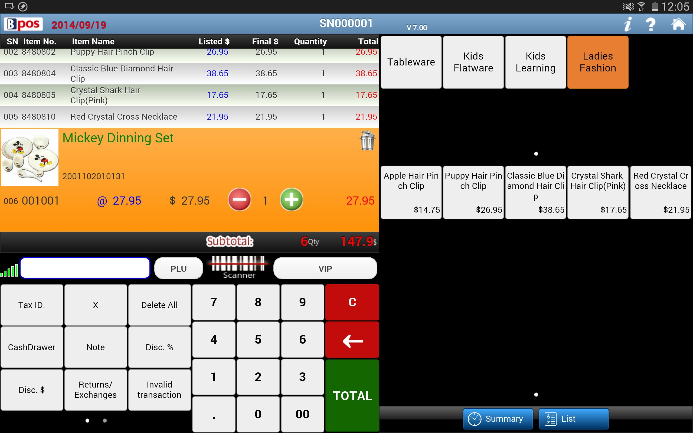

# Legacy Point Of Sales Report System
    
This project automates the extraction and reporting of sales data from a legacy POS system (Visual Basic frontend with Microsoft Access `.mdb` database). It produces PDF reports and sends them by email (configurable).



## Context
Legacy POS systems built with Visual Basic and Microsoft Access databases are still widely used in the MENA (Middle East & North Africa) region. This tool bridges the gap between these older reliable systems and modern reporting needs.

## Requirements
- Python 3.8+
- `mdbtools` (for database extraction)
- `pandas`, `reportlab` (see `requirements.txt`)

## Setup

### Windows (Recommended via WSL)
Since `mdbtools` is primarily a Linux tool, it is highly recommended to run this project on Windows using **WSL (Windows Subsystem for Linux)**.

1.  **Install WSL**:
    Open PowerShell as Administrator and run:
    ```powershell
    wsl --install
    ```
    (Restart your computer if prompted).

2.  **Install Dependencies (Ubuntu/Debian)**:
    Open your WSL terminal (e.g., "Ubuntu" from the start menu) and run:
    ```bash
    sudo apt-get update
    sudo apt-get install mdbtools python3 python3-pip python3-venv
    ```

3.  **Setup Project**:
    ```bash
    # Clone the repo
    git clone https://github.com/BlcMed/legacy-pos-reporter.git
    cd legacy-pos-reporter
    
    # Create virtual environment
    python3 -m venv venv
    source venv/bin/activate
    
    # Install Python packages
    pip install -r requirements.txt
    ```

4.  **Configure**:
    Copy the sample config and edit it with your details:
    ```bash
    cp settings.ini.sample settings.ini
    nano settings.ini
    ```

## Automating Reports (Windows Task Scheduler)

You can automate the daily reporting using **Windows Task Scheduler** to trigger the script inside WSL.

1.  Open **Task Scheduler** in Windows.
2.  Click **Create Basic Task** and name it (e.g., "Daily POS Report").
3.  Set the trigger to **Daily** and choose a time (e.g., 8:00 AM).
4.  For **Action**, choose **Start a program**.
5.  **Program/script**: `wsl.exe`
6.  **Add arguments**:
    ```text
    cd ~/legacy-pos-reporter && ./venv/bin/python3 run_daily.py
    ```
    *(Adjust the path if you cloned it somewhere else)*.

7.  Finish the wizard.


## License

This project is licensed under the MIT License - see the [LICENSE](LICENSE) file for details.
